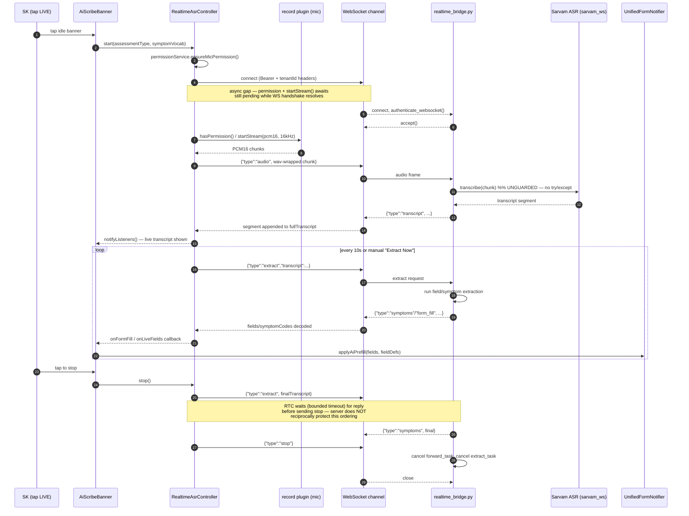

# AI Scribe / Realtime ASR — Intermittent Silent-Failure Investigation

**Status:** Root-cause investigation complete (systematic-debugging Phase 1–3). No fixes applied — this
is the diagnostic handoff. Phase 4 (failing test + fix + verify) should be scoped as separate follow-up
tickets per hypothesis below, in ranked order.

**Symptom:** After an SK finishes recording, the ASR card intermittently shows no transcript and no
form fields populate, usually with no visible error. Reported by a majority of field users at some
point; not reliably reproducible.

---

## 0. Critical architecture finding — read this first

The bug report describes the pipeline in terms of chunked upload / job polling / `results/{jobId}`.
That pipeline **exists and is fully implemented**, but tracing every call site of
`ScribeController.startRecording()` and `AiScribeBanner` shows it is **not the code path actually
running in the field**:

- `AiScribeBanner` (`lib/features/scribe/widgets/ai_scribe_banner.dart:278-284`) only calls the batch
  `controller.startRecording()` when `tapStartsLiveAsr == false`.
- The two production screens that render the banner both pass `tapStartsLiveAsr: true`:
  - Step 1 triage — `lib/features/visit/triage/symptom_picker_screen.dart:1169`
  - Step 2 assessment form — `lib/features/visit/forms/unified_form_screen.dart:553`
- `ScribeController.startRecordingForTriage`/`.startRecording` have no other production callers.

**Consequence: the "beta" Realtime ASR WebSocket path (`RealtimeAsrController` ↔
`app/api/realtime.py` / `realtime_bridge.py`) is the sole pipeline exercised by both visit steps in
production today.** The batch upload/poll/SOAP-review pipeline (`ScribeController.stopRecording` →
`ScribeApiService.submitAudio*` → `/scribe/results/{jobId}` → review sheet) is fully wired and tested
but currently dormant/unreachable from the UI. This inverts the expected investigation priority: the
WebSocket-related bullet points in the original problem statement aren't boilerplate — they describe
the actual live pipeline. Sections 1–4 below cover the realtime path first for that reason; the batch
path is covered in Section 5 for completeness (it's one config change away from being live again, and
its own bugs are real).

Also verified as dead code while tracing this: `ScribeMode.formPrefill` /
`submitAudioForFormPrefill` / `ScribeState.fieldsPopulated` / `AIFormMixin.applyAIValues` are fully
implemented but have **zero reachable call sites** — no screen ever sets `_currentMode` to
`formPrefill`, and `applyAIValues` is never invoked. Worth a cleanup ticket on its own, but not part of
this bug.

---

## 1. Sequence diagram — realtime (LIVE) ASR, the pipeline actually in production



**Where this diagram already shows the failure surface:** the async gap noted at step 4 (permission +
`startStream()` awaits racing the WS handshake) and the one-way ordering guarantee at the stop sequence
(client waits for the server, but the server does not wait for / drain the client's final extract) are
exactly the two structural weaknesses that make this pipeline lossy under timing pressure — not
edge-case bugs, but built into the current handshake shape.

## 2. Sequence diagram — batch upload/poll SOAP pipeline (implemented, currently unreachable from UI)

```mermaid
sequenceDiagram
    autonumber
    participant SK as SK
    participant Ctrl as ScribeController
    participant Waveform as audio_waveforms (viz only)
    participant Rec as record plugin (file capture)
    participant API as ScribeApiService
    participant BG as FastAPI BackgroundTasks
    participant Worker as worker.py (job processor)
    participant STT as ASR provider (sarvam/gemini/openai)
    participant LLM as field-extraction LLM

    SK->>Ctrl: startRecording()
    Ctrl->>Waveform: record() [fire-and-forget on stop]
    Ctrl->>Rec: AudioRecorder.start()
    SK->>Ctrl: stopRecording()
    Ctrl->>Rec: stop() [awaited]
    Ctrl->>Ctrl: verify file exists && size > 0
    alt file >= 1MB
        Ctrl->>API: chunked upload (init → chunks → complete)
        API->>API: chunks written to LOCAL disk;<br/>session state in Redis (shared)
    else file < 1MB
        Ctrl->>API: POST /scribe/transcribe (multipart)
        API->>BG: enqueue S3 upload + mark_queued (same process, post-response)
    end
    API-->>Ctrl: 202 {jobId}
    Ctrl->>Ctrl: _startPolling(jobId) — 2.5s interval, 90s timeout
    loop poll
        Ctrl->>API: GET /scribe/results/{jobId}
        API-->>Ctrl: status
    end
    Worker->>STT: transcribe_audio()  %% no asyncio.wait_for timeout
    STT-->>Worker: transcript
    Worker->>LLM: run_inference(transcript)  %% try/except swallows failure
    LLM-->>Worker: clinical fields (or swallowed exception → empty fields)
    Worker->>Worker: mark_completed(status, result_json)  %% no version guard
    Ctrl->>API: GET /scribe/results/{jobId} (completed)
    API-->>Ctrl: soap / transcript / fields
    Ctrl->>Ctrl: state = reviewReady
    Ctrl-->>SK: review sheet auto-opens (VisitFormScreen listener)
```

---

## 3. Every failure point identified, by pipeline stage

### 3.1 Audio capture (client)
| # | Failure point | Location |
|---|---|---|
| A1 | Two concurrent recorders per batch session (`audio_waveforms` for viz, `record` for the real file) can contend for the mic on some OEM Android builds | `scribe_controller.dart:54-58` |
| A2 | `audio_waveforms.stop()` is fire-and-forget (`unawaited`) because it can hang on Android; a 50ms delay is inserted "to reduce" (not eliminate) the hang | `scribe_controller.dart:602-611` |
| A3 | No minimum-duration check after capture — a near-silent/very short clip passes the `size > 0` check and uploads, producing an empty transcript with no failure signal | `scribe_controller.dart:284-289` |
| A4 | Plain (one-time) mic permission denial gives **zero user feedback** — visually identical to a tap that did nothing; only `isPermanentlyDenied` shows a dialog | `scribe_permission_service.dart:26-30` |
| A5 | `AndroidAudioSource.defaultSource` (batch) and `.mic` (realtime default) route through/skip AEC differently; `rawMicCapture` toggle exists specifically because the processed chain can cancel a played-back test clip down to near-silence with no error — a real field failure mode if an SK ever holds the phone to a speaker (translation apps, a second phone) instead of speaking directly | `scribe_record_config.dart:14-36` |
| A6 | Realtime path: VAD gate can classify real but moderate-volume speech as silence indefinitely in sustained high ambient noise (crowded household, outdoor visit) — chunks are captured by the mic but never sent, with no user-facing indicator | `vad_gate.dart:144-150` |

### 3.2 Audio streaming / upload
| # | Failure point | Location |
|---|---|---|
| S1 | Realtime: async gap between WS `connect()` firing and `startStream()` actually beginning — if the handshake fails during this window, later code unconditionally overwrites state back to `listening` (see H1) | `realtime_asr_controller.dart:234-297` |
| S2 | Batch: chunked-upload chunks land on local ephemeral disk while session/progress coordination lives in shared Redis — under >1 API replica without sticky routing, a later chunk or the `complete` call can land on a pod missing earlier chunks | `app/repositories/uploads.py`, `app/api/upload.py:280` |
| S3 | `assemble_file` has no try/except around `chunk_path.read_bytes()` — a missing chunk raises an uncaught `FileNotFoundError`, surfacing as a bare 500 with no job ever created | `app/repositories/uploads.py:254-296` |
| S4 | Direct-upload path's S3 write + `mark_queued` runs as a same-process `BackgroundTasks` callback *after* the 202 response — if the worker process is recycled/OOM-killed in that window (deploys, autoscaling), the task is silently dropped; only the 600s orphan reaper eventually fails the job | `app/api/scribe.py:109-133` |

### 3.3 WebSocket connection (realtime path — the live pipeline)
| # | Failure point | Location |
|---|---|---|
| W1 | **Startup race — top hypothesis, see H1.** WS `onError` correctly sets error state and nulls `_channel`, but code that runs after two subsequent `await`s (`hasPermission()`, `startStream()`) unconditionally sets `state = listening`, clobbering the error state back to "healthy" | `realtime_asr_controller.dart:234-297` |
| W2 | No reconnection logic anywhere in the controller — any mid-session drop tears down to `idle`, losing the accumulated transcript, with no retry/backoff | `realtime_asr_controller.dart` (whole-file finding) |
| W3 | No ping/pong in either direction — client `"ping"` is a documented no-op; server never proactively pings or times out an idle read, so a half-open TCP connection (common on flaky field cellular) can hang `websocket.receive_json()` indefinitely instead of closing cleanly and letting the client detect it | `realtime_bridge.py` (no keepalive present) |
| W4 | Gunicorn `max_requests=1000` + `graceful_timeout=30` — a long-lived WS session counts against worker request quota; a worker recycle under load gives an in-flight session only ~30s before SIGKILL, dropping whatever extraction/transcribe call was in flight with **no application-level error** | `gunicorn.conf.py:12-21` |
| W5 | Stop-sequence asymmetry — client `stop()` waits (bounded) for the server's final extract reply, but the server does not reciprocally wait for/drain an in-flight extract before honoring `stop`; see H3 | `realtime_asr_controller.dart:305-335` vs. `realtime_bridge.py:429-436` |

### 3.4 Backend processing
| # | Failure point | Location |
|---|---|---|
| B1 | `sarvam_ws.transcribe()` called with no try/except in the realtime audio-frame path; any transient failure propagates to the outer handler, whose own `send_json({"type":"error",...})` can itself fail if the underlying connection is what broke — swallowed by a bare `except Exception: pass` | `realtime_bridge.py:379-384`, `437-445` |
| B2 | `forward_from_sarvam` background task's exceptions are only logged at `warning`; nothing supervises its health after that — the session goes "zombie" (client still streaming/extracting, server silently not forwarding) | `realtime_bridge.py:289-297` |
| B3 | Concurrent `extract` requests (auto 10s timer racing a manual "Extract Now", or a slow LLM call) are dropped with a `logger.debug` only — no reply frame sent for the discarded one | `realtime_bridge.py:413-420` |
| B4 | `stop` handling `.cancel()`s an in-flight `extract_task` instead of draining it — the session's likely-most-complete transcript/extraction is thrown away mid-flight | `realtime_bridge.py:429-436` |
| B5 | Batch: field-extraction LLM call failures are fully swallowed — caught, logged at `warning`, and the job still proceeds to `mark_completed` with an empty `ClinicalFields`. The client sees `status: "completed"` with nothing to show and **no error field to render** | `app/services/pipeline.py:321-328` |
| B6 | Batch: no `asyncio.wait_for` timeout anywhere around the ASR call; `sarvam.py`'s `job.wait_until_complete()` has no timeout param and can block a thread-pool slot indefinitely. Accumulated hangs across a long-running deployment eventually starve unrelated new jobs | `app/services/pipeline.py:148,153`, `sarvam.py:38` |
| B7 | Batch: `mark_completed`/`mark_failed` have no optimistic-concurrency/version guard — a reaped-and-reclaimed job double-processed by two workers can have a `failed` write silently clobbered back to `completed` (or vice versa) minutes after the client stopped polling | `app/repositories/jobs.py:217-245` |

### 3.5 Client state management
| # | Failure point | Location |
|---|---|---|
| M1 | `ScribeController.dispose()` has no disposed-guard; hosting screens (`visit_form_screen.dart:171-176`, `visit_flow_screen.dart:245-246`) call `dispose()` synchronously on route pop without checking `session.isActive`. An in-flight `_pollOnce()` await keeps running after `dispose()`; its eventual `notifyListeners()` is only guarded by `assert()`, which **compiles out in release builds** — a completed result arriving just after the SK navigates away is discarded with zero trace | `scribe_controller.dart:930-938` |
| M2 | Realtime: JSON parse failures in `_onMessage` only `debugPrint` — never surfaced to `_errorMessage`/UI | `realtime_asr_controller.dart` (`_onMessage`) |
| M3 | Realtime: `stop()`'s `onTimeout: () {}` for the final-extraction wait is silent — unlike the parallel safety-timeout path, a truncation event here leaves no trace to diagnose | `realtime_asr_controller.dart:305-335` |
| M4 | Cross-controller mic race on screen transition: `AiScribeBanner.dispose()` stops a live session via `unawaited(_liveCtrl.stop()...)` which can take up to 15s; if the next screen's recorder starts before mic release completes, two `AudioRecorder` instances contend | `ai_scribe_banner.dart:151-168` |

### 3.6 Form population
| # | Failure point | Location |
|---|---|---|
| F1 | `applyAiPrefill`'s "SK always wins" + schema-validation gate silently drops any field that fails validation or targets an SK-owned field — reported back as `rejected` strings, but only logged via `debugPrint`, never shown in the UI | `unified_form_notifier.dart:1359-1420`, consumed at `unified_form_screen.dart:561-564` |
| F2 | Dead code confirmed: `ScribeMode.formPrefill` / `fieldsPopulated` / `AIFormMixin.applyAIValues` have no reachable production call site — not a live bug, but a maintenance trap if anyone assumes this path is active | `scribe_controller.dart`, `ai_form_fields.dart:283-293` |

### 3.7 Error handling — every silent/no-signal path found
This is the consolidated list the report asked for explicitly (§7 "identify every path where failures
are ignored or logged silently"):

- `realtime_bridge.py:437-445` — outer error handler's own `send_json` failure swallowed by bare `except Exception: pass`
- `realtime_bridge.py:289-297` — `forward_from_sarvam` failures logged, task just ends, no supervision
- `realtime_bridge.py:413-420` — dropped concurrent extract, `logger.debug` only, no reply frame
- `app/services/pipeline.py:321-328` — LLM extraction failure swallowed, job still marked completed
- `app/repositories/uploads.py` — `assemble_file` missing-chunk `FileNotFoundError` uncaught → bare 500
- `sarvam.py:55-63` — temp-file cleanup wrapped in `except Exception: pass` (low risk, cleanup-only)
- `scribe_controller.dart:930-938` — post-dispose `notifyListeners()` guarded only by a release-stripped `assert`
- `realtime_asr_controller.dart` `_onMessage` — malformed WS frame JSON parse failure, `debugPrint` only
- `realtime_asr_controller.dart:305-335` — final-extraction wait timeout, silent `onTimeout: () {}`
- `scribe_permission_service.dart:26-30` — plain permission denial, no message at all
- `unified_form_notifier.dart` `applyAiPrefill` — validation-rejected fields, `debugPrint` only, never shown to the SK

---

## 4. Root-cause hypotheses, ranked by likelihood

Ranking weighs both mechanism plausibility and real-world exposure — since Section 0 established the
realtime WebSocket path is what every field session actually runs through, bugs in that path get
weighted higher than structurally similar bugs in the currently-unreachable batch path.

### H1 — Realtime startup race silently reverts a failed connection to "listening" (highest confidence)
**Mechanism:** `RealtimeAsrController.start()` wires `_wsSub` with a correct `onError` handler that sets
`state = error` and nulls `_channel`. But execution continues past that point through two more
`await`s (`_recorder.hasPermission()`, `_recorder.startStream()`) before unconditionally executing
`_state = RealtimeAsrState.listening;` with no re-check of whether the socket is still alive. If the WS
handshake fails during that window — an expired token, a backend restart, TLS hiccup, or a
mobile-network blip exactly when the SK taps to start — the controller ends up in `listening` state
with `_channel == null`. From here: `_send()` silently drops every audio frame (`debugPrint`-only), the
transcript never grows, `extractNow()` no-ops because there's no transcript to extract, and the banner
shows "Listening…" indefinitely. **Zero error, mic visibly active, nothing ever arrives** — this is the
most literal match for the reported symptom, and it's a timing race, which explains why it isn't
reliably reproducible but is common enough to hit "a majority of users eventually" on real field
networks.
**Code:** `lib/features/realtime_asr/realtime_asr_controller.dart:234-297`

### H2 — Backend `sarvam_ws.transcribe()` call is unguarded, kills the session with no error frame
**Mechanism:** Any transient error from the ASR provider during audio forwarding propagates out of the
receive loop uncaught. The fallback error-reporting path (`send_json({"type":"error",...})`) can itself
fail if the break was in the underlying connection, and that failure is swallowed by a bare
`except Exception: pass`. Net effect: the socket just closes, the client's `onDone`/`onError` may or may
not fire depending on how the platform reports the close, and no transcript or error content was ever
sent.
**Code:** `app/services/realtime_bridge.py:379-384`, `437-445`

### H3 — `stop` cancels rather than drains the in-flight final extraction
**Mechanism:** The client is coded to wait for a bounded timeout for the server's reply to its final
`extract` before sending `stop`. The server does not reciprocate: on receiving `stop` it immediately
cancels `extract_task`. If the client's bounded wait is shorter than the server's actual LLM latency (a
cold model call, a slow network hop), the client gives up, sends `stop`, and the server discards the
in-flight work that would have produced the session's most complete result — often the *only* result if
the SK spoke mostly in the final seconds before tapping stop (a very plausible field pattern:
gathering-thoughts-then-summarizing).
**Code:** `realtime_asr_controller.dart:305-335` vs. `realtime_bridge.py:429-436`

### H4 — Batch-path LLM extraction failure swallowed into a fake "completed" (if/when this path is reactivated)
**Mechanism:** Any inference error is caught, logged at `warning`, and replaced with an empty
`ClinicalFields` object — the job still reports `status: completed`. The client has no `error` field to
render in this case, so it shows nothing changed with no error. Currently latent (Section 0), but will
resurface the moment anyone re-enables `formPrefill` mode or a future release flips a default back to
the batch path.
**Code:** `app/services/pipeline.py:321-328`

### H5 — Gunicorn worker recycling drops long-lived WS sessions mid-flight
**Mechanism:** `max_requests=1000` (+jitter) forces periodic worker recycling; a WS connection counts
against that quota for its full lifetime. A worker torn down mid-session gives in-flight work only the
30s `graceful_timeout` before SIGKILL. This is a pure infrastructure/session-duration effect — the
longer a visit's live-ASR session stays open, the higher the chance it lands on a recycle boundary,
which fits "intermittent" and "majority of users at some point" better than a deterministic bug would.
**Code:** `gunicorn.conf.py:12-21`

### H6 — No reconnection logic; any network blip permanently ends the session
**Mechanism:** Field connectivity (rural/community settings, the app's own offline-first design intent)
means WS drops are expected, not exceptional. The controller has no retry/backoff — a single drop
tears down to `idle`, discarding the accumulated transcript, forcing the SK to notice and manually
restart. This doesn't produce a silent "nothing happened" experience by itself (the state does change),
but combined with H1's race it's easy for an SK to restart into another failed connection and never
realize why.
**Code:** `realtime_asr_controller.dart` (absence of retry logic)

### H7 — VAD gate misclassifies real speech as silence in noisy field conditions
**Mechanism:** In sustained high ambient noise near the gate's ceiling, a moderate-volume speaker may
never clear the enter-margin threshold. Chunks are captured by the mic (so device-level "is audio
happening" telemetry would look healthy) but never sent to the server. This is the strongest candidate
for cases where the *client-side* audio pipeline is entirely healthy and the failure is purely
acoustic/environmental — worth weighting up if instrumentation (Section 6) shows healthy WS sessions
with abnormally short transcripts specifically in loud/crowded environments.
**Code:** `lib/features/realtime_asr/vad_gate.dart:144-150`

### H8 — `ScribeController` disposed while a poll is in flight (batch path only, currently latent)
**Mechanism:** Real, but narrow — the race window is one in-flight `_pollOnce()` call (≤2.5s), and it
only matters once the batch path is reachable again. Included for completeness since Section 3.5
documents it and it will matter the moment `tapStartsLiveAsr` is ever flipped back to `false` for any
screen.
**Code:** `scribe_controller.dart:930-938`

---

## 5. Missing logging / telemetry

None of the silent paths in §3.7 currently emit anything a remote-log aggregator could alert on — they
are all `debugPrint` (stripped or ignored in release) or backend `logger.debug/warning` with no
structured field to filter by. Concretely missing:

1. **A session-outcome event, emitted exactly once per recording/live-ASR attempt**, client-side, with a
   terminal status: `capture_ok`, `capture_empty`, `ws_handshake_failed`, `ws_dropped_mid_session`,
   `extract_timeout`, `extract_delivered`, `form_fields_applied(n)`, `form_fields_rejected(n)`. This is
   the single highest-value addition — today there is no event that fires when a session produces
   *nothing*, only ones that fire when something happens.
2. **WS connect/close/error telemetry** — close code, close reason, and which side initiated the close
   (client `stop()` vs. server-side drop vs. network exception) are not currently captured anywhere
   client-side beyond a `debugPrint`.
3. **Backend: a metric/log line for every `sarvam_ws.transcribe()` exception**, tagged with session id,
   currently invisible because it's uncaught and only surfaces as a generic connection-closed log line.
4. **Backend: a counter for dropped concurrent-extract requests** (`realtime_bridge.py:413-420`) —
   right now this is genuinely invisible; nothing distinguishes "SK tapped Extract Now twice" from
   "extraction is starving."
5. **Backend: worker-recycle-during-active-session counter** — correlating gunicorn recycle events with
   sessions that were live at that moment would directly confirm/refute H5.
6. **Client: VAD gate state exposed as telemetry**, not just an internal boolean — specifically "audio
   captured but gated as silence for >Ns" as its own counter, to separate H7 from a true capture/upload
   failure.
7. **Client: `applyAiPrefill` rejection reasons** (§F1) are computed but never sent anywhere — surfacing
   them (even just as a debug log with session id) would show whether the pipeline is delivering fields
   that the validation gate is quietly rejecting, vs. delivering nothing at all.
8. **Backend: structured job-state transition log for the batch pipeline** (`queued → processing →
   completed/failed`, with which worker/attempt) — needed before H4/H8 can be confirmed if that path is
   ever reactivated.

## 6. Additional instrumentation to distinguish the six failure categories

| To tell apart... | ...instrument this |
|---|---|
| Audio capture failure | Client-side: log actual bytes captured / PCM frame count per session (not just "recording started"). If frame count is healthy but nothing reaches the server, capture is not the problem. |
| Audio upload/streaming failure | Log bytes *sent* over the WS (or multipart upload) vs. bytes *captured* — a gap here isolates a client-side send/backpressure problem from a capture problem. |
| WebSocket failure | Emit the close code/reason and which side closed first (see §5.2). A clean client-initiated `stop` close vs. an abrupt 1006/no-close-frame from the server are different bugs. |
| Backend ASR failure | Backend: log `sarvam_ws.transcribe()` outcome (success/exception/timeout) per audio frame or per session, independent of whether the WS itself stayed open — today an ASR failure and a WS failure are indistinguishable from the client's point of view. |
| Transcription rendering failure | Client: log when a `{"type":"transcript"/"symptoms"}` frame is *received* vs. when it is *applied* to `_segments`/`fields` state — a gap here means the data arrived but a client-side parse/state-update bug ate it (see M2). |
| Form population failure | Client: log every `applyAiPrefill` call with `(fieldsIncoming, fieldsApplied, fieldsRejectedWithReasons)` — today `rejected` is computed and discarded (F1); persisting it turns "form fields didn't populate" from a mystery into a specific, attributable validation failure. |

Emitting all six as one correlated session-id-keyed trace (even just structured `debugPrint`/backend
log lines shipped to whatever crash/analytics pipeline this app already uses) would let a single
production report be triaged to one of these six categories without needing the SK to reproduce
anything.

## 7. Suggested fixes

Ordered to match the ranked hypotheses in Section 4. Each should go through
`superpowers:test-driven-development` (failing test first) and
`superpowers:verification-before-completion` before being called done — this report stops at diagnosis,
per the systematic-debugging process this investigation followed.

1. **H1 (startup race):** After the permission + `startStream()` awaits in `start()`, re-check that the
   channel is still non-null / the WS is still open before setting `state = listening`. If the socket
   already errored during that window, stay in (or re-enter) the error state instead of overwriting it.
2. **H2 (unguarded transcribe call):** Wrap the `sarvam_ws.transcribe()` call in its own try/except that
   sends a scoped `{"type":"error", ...}` frame and lets the session continue (or cleanly close with a
   reason) rather than propagating into the shared outer handler whose own error-send can fail silently.
3. **H3 (stop cancels in-flight extract):** On receiving `stop`, `await` the in-flight `extract_task`
   with its own bound (matching or slightly exceeding the client's wait timeout) instead of cancelling
   it outright, so a nearly-complete extraction is still delivered before teardown.
4. **H4 (swallowed inference failure):** Have the except-block set an explicit `error` field on the job
   result instead of returning an empty `ClinicalFields` as if extraction had legitimately found
   nothing — even though this path is currently unreachable, fix it before it's reactivated.
5. **H5 (worker recycling):** Either exclude active WS connections from the `max_requests` count, or
   have the graceful-shutdown path send a `{"type":"error","reason":"server_restarting"}` frame before
   closing so the client can distinguish this from a silent drop and immediately show a "reconnecting"
   state instead of nothing.
6. **H6 (no reconnection):** Add bounded auto-reconnect (with backoff) on unexpected WS close, re-using
   the accumulated transcript rather than discarding it, matching the resiliency expectations in
   Section 8.
7. **H7 (VAD gating real speech):** Surface a client-visible indicator when the gate has been
   suppressing input for more than a few seconds ("still listening, but audio seems quiet") instead of
   only ever showing generic "Listening…" — turns a silent environmental failure into an actionable one.
8. **H8 (dispose race):** Add an explicit `_disposed` flag checked before every `notifyListeners()` call
   in `ScribeController`, and have hosting screens await an in-flight `stopRecording()`/poll before
   disposing when `session.isActive`.
9. **F1 (silent validation rejects):** Surface `applyAiPrefill`'s `rejected` list to the SK (even a
   small non-blocking toast/banner note) instead of only `debugPrint`, so a validation-driven "nothing
   changed" is distinguishable from a pipeline failure.

## 8. Resiliency recommendations

- **Reconnection with state preservation:** bounded exponential backoff on unexpected WS close,
  re-sending the accumulated (not-yet-extracted) transcript buffer on reconnect rather than starting
  over silently.
- **Keepalive:** add real ping/pong in both directions with a short idle timeout, so a half-open
  connection is detected and torn down/reconnected within seconds instead of hanging indefinitely.
- **Server-side session draining on `stop`/shutdown:** always await in-flight extraction work (bounded)
  before closing, whether triggered by client `stop` or server-side graceful shutdown.
- **Timeouts everywhere an external call can hang:** wrap every ASR-provider call (both batch and
  realtime) in `asyncio.wait_for`, with the timeout itself becoming a well-formed `failed`/`error`
  result rather than an indefinitely-parked thread or coroutine.
- **Health checks:** a lightweight WS health probe (or reuse of the ping/pong above) that the client can
  use to proactively detect a degraded/dead session mid-visit rather than discovering it only when no
  transcript ever appears.
- **Idempotent, versioned job-state writes** for the batch pipeline (`mark_completed`/`mark_failed` with
  an attempt/version check) so double-processing can't silently clobber a terminal state.
- **User-visible degradation, always:** every one of the silent paths in §3.7 should have a
  corresponding user-facing state — even a generic "Something went wrong — try recording again" beats
  the current experience of the banner quietly reverting to idle/listening with no explanation.

---

# Part 2 — Single-session termination trace (which hypothesis is actually responsible)

Part 1 above was static analysis: every hypothetical bug findable by reading the code in isolation.
This part traces one realtime ASR session start-to-finish from the actual source
(`realtime_asr_controller.dart` client-side, `run_bridge_session()` in `realtime_bridge.py` backend-side)
to enumerate every point the session can *actually* end without a transcript, and rank them by real
production likelihood rather than by how easy each was to spot. No fixes below — same diagnosis-only
scope as Part 1.

## The fact that reframes the ranking

```dart
bool get isActive =>
    _state == RealtimeAsrState.connecting ||
    _state == RealtimeAsrState.listening ||
    _state == RealtimeAsrState.stopping;
```
`realtime_asr_controller.dart:169-172` — **`RealtimeAsrState.error` is not in this list.**
`AiScribeBanner` only mounts the panel that reads `controller.errorMessage` when
`liveActive (= _liveCtrl.isActive)` is true (`ai_scribe_banner.dart:236, 416-419`), and the banner's
own top-level `isError` flag reads the *batch* `ScribeController`'s state, never `_liveCtrl.state`.

**Every call to `_setError()` in `RealtimeAsrController` is therefore guaranteed — deterministically,
not probabilistically — to be invisible to the SK.** The banner falls straight through to its plain
idle "tap to record" render on the next frame. This is not a race condition; it fires 100% of the time
any of the client-side error paths below trigger.

## Every termination point, in session order

| # | Exact code path | Trigger condition | User sees error? | Logged? | Telemetry? | Recoverable? |
|---|---|---|---|---|---|---|
| T1 | `realtime_asr_controller.dart:205-206` | Tap lands in the one frame the widget is unmounting | No | None | None | Yes, re-tap works |
| T2 | `...:228-232` mic permission denied → `_setError()` | OS permission denied/revoked | **No** (see above) | None | None | Yes, after granting |
| T3 | `...:293-297` outer catch, `_service.connectionInfo()` throws | Token export/local network stack failure pre-socket | **No** | `debugPrint` only | None | Yes, retry |
| T4 | `...:293-297` outer catch, recorder init throws | Native audio HAL failure, mic held by another app | **No** | `debugPrint` only | None | Yes, retry |
| T5 | WS handshake rejected pre-`accept()` (`realtime.py:83-90`) → client `onError` (`...:245-252`) | Expired/invalid token, missing `tenantId`, UHIS auth-service down/slow (5s `httpx` timeout, `auth.py:147`) | **No**, plus race below | `debugPrint` client-side only | None | Yes, but SK has no idea why |
| T6 (race) | T5 racing `...:272-279`: `connectRealtimeChannel()` (`realtime_asr_channel_io.dart:20`, `IOWebSocketChannel.connect()` is **non-blocking**) vs. the awaited recorder-start, then the unconditional `_state = listening` write at line 279 | Whichever finishes first — local mic init (tens–hundreds of ms) vs. a real network round trip over field connectivity | Two distinct bad outcomes — see below | `debugPrint` only | None | No — dead either way, needs manual retry |
| T7 | Per-frame `sarvam_ws.transcribe()` raises (`realtime_bridge.py:380-384`) → outer `except Exception` (`:437-445`) → best-effort error send → `websocket.close()` | Transient Sarvam-side error on any single frame | Briefly, in principle; practically almost never (see below) | **Yes** — `logger.exception` at `:441` + `pipeline_logging.fire_run_failed` | Possibly, if `pipeline_logging` is monitored | No |
| T8 | `forward_from_sarvam` (`realtime_bridge.py:289-297`) — its `async for` raises **or simply ends cleanly** | Any Sarvam-side hiccup, or the SDK stream just completing | **No** — client WS stays open, nothing errors or closes | Exception path: `logger.warning`. **Clean-end path: nothing at all** | None | No — task never restarted/supervised; session runs to a normal-looking `stop()` with zero transcript |
| T9 | Concurrent `"extract"` dropped (`realtime_bridge.py:417-420`) | Auto 4s tick fires while a prior extraction is in flight | No | `logger.debug` (invisible at prod levels) | None | Self-healing next tick, unreliable |
| T10 | Client 20s extraction safety-timeout (`...:371-378`) | Backend never answers a specific `extract` | No | `debugPrint` only | None | Yes, next tick |
| T11 | `stop()`'s final-extraction wait times out (`...:326-328`, `onTimeout: () {}`) paired with backend `finally: extract_task.cancel()` (`realtime_bridge.py:434-436`) | Final LLM call exceeds 15s; `CancelledError` is a `BaseException`, not caught by `run_extraction`'s `except Exception` | No | **Nothing on either side** | None | No — last utterance lost |
| T12 | Backend `WebSocketDisconnect` (`realtime_bridge.py:431-432`) | App backgrounded/OS-killed the socket | Depends if app is foregrounded | Logged as **`fire_run_complete`, not failed** | Actively misleading | No |
| T13 | VAD gate suppresses real speech (`vad_gate.dart:144-150`) | Sustained loud/crowded environment under the enter-margin threshold | No | None for this case | None | N/A — no failure occurred |

### The T6 race, precisely
- **Error detected before line 279 runs:** `onError` sets `state=error` + `errorMessage`, starts
  `unawaited(_teardown())` (nulls `_channel`, cancels the then-null `_audioSub`). `start()`'s coroutine
  then finishes its awaits and unconditionally executes `_state = listening`, overwriting `error`. The
  subsequent `_audioSub = stream.listen(...)` creates a **new, live mic subscription no teardown call
  knows about**. Net: banner header says "Listening", the panel *does* render (state is listening, not
  error, so `isActive` is true) — showing the raw exception string indefinitely next to a healthy-looking
  header, while the mic keeps recording into a channel that silently drops every frame
  (`_send`'s `if (_channel == null) { debugPrint(...); return; }`, `:879-882`).
- **Error detected after line 279 runs:** `_setError()` flips state to `error` for real — which, per the
  mechanism above, is immediately and permanently invisible. `_teardown()` properly stops the mic. Banner
  reverts fully and silently to idle. Zero trace.

Field connectivity failures (timeouts, slow DNS, congested mobile data) tend to be *slow* to surface, so
the second sub-variant — full silent revert to idle, mic actually off — is the more likely real-world
shape of this race for connectivity-driven failures specifically.

## Ranked by probability, given the reported symptom

1. **T8** — `forward_from_sarvam` dying mid-session is live for the *entire* session duration (not just
   startup), generates zero signal anywhere, and alone explains both halves of the symptom (no
   transcript, no fields) with one cause.
2. **T6, silent-revert sub-variant.** The invisibility is guaranteed by the isActive/error bug; only the
   trigger (connect-time auth/network failure) is probabilistic, and it's common on field connectivity.
   Fires on every connect attempt, not just once per install.
3. **T2/T3/T4 as a class** — same guaranteed invisibility, rarer individual triggers (permission
   revocation, local recorder failure, `connectionInfo()` throwing).
4. **T11** — needs an in-flight extraction *and* backend latency over 15s, but is the single most likely
   explanation for "the last thing I said didn't make it in," and has zero log trace anywhere today.
5. **T7** — does attempt client notification and does log properly server-side, so plausibly already
   partially diagnosable from existing `logger.exception` output.
6. **T12** — real, but self-explanatory to the SK in a way that makes it a less likely "no clear reason"
   report.
7. **T13** — environment-dependent and not a bug; worth ruling in/out early since a fix here (if needed)
   is a tuning change, not a code fix.
8. **T9/T10** — lower as a cause of *total* silence (transcript delivery unaffected); more relevant to a
   "transcript showed, fields didn't" variant of the report.
9. **T1** — self-corrects on retry; reads to the SK as "my tap didn't register," not "I recorded and got
   nothing."

## Five instrumentation points to isolate the actual cause in one day

Chosen to partition the hypothesis space above with the fewest touches — each answers one either/or
question; no architectural change, no retries/reconnects/timeouts added.

1. **Client — one consolidated per-session summary log at the top of `_teardown()`** in
   `realtime_asr_controller.dart`: `rawChunksCaptured` (pre-VAD), `chunksSentAfterVad`,
   `framesDroppedNoChannel` (promote the existing `:880` debugPrint to a counter), `segmentsReceived`,
   `extractRequestsSent`, `extractRepliesReceived`, `finalState`, `finalErrorMessage`, `closeReason`
   (manual-stop / onError / onSocketDone). One line distinguishes T8 (sent, zero segments) from
   T6/T2-4 (never got past connecting) from T9-11 (segments fine, replies missing) from T13 (raw high,
   post-VAD ≈0).
2. **Client — log every call to `_setError()`** (single chokepoint method): `message, previousState,
   timestamp`. Proves how often the client-side error path fires in production and with which message,
   even though the UI currently discards it — fastest way to confirm the mechanism is firing and which
   trigger dominates.
3. **Backend — log both exits of `forward_from_sarvam`** (`realtime_bridge.py:289-297`): add a running
   `segments_forwarded` count to the existing `except` warning, and add a line at the point the
   `async for` loop ends *without* an exception (currently logs nothing). Directly targets the
   top-ranked hypothesis.
4. **Backend — one consolidated per-session summary log in `run_bridge_session`'s outer `finally`**
   (`:446-469`): `session_id, tenant_id, user_id, session_failed, session_error_type, extraction_count,
   len(accumulated_transcript), sarvam_duration_ms, exit_path`. The client never learns the server's
   `session_id` today, so correlate by tenant/user/approximate timestamp. Catches T12's "logged as
   success but the client got nothing."
5. **Backend — log whether `extract_task` was cancelled while still pending**, in the same `finally`
   that cancels it (`:433-436`): `if extract_task is not None and not extract_task.done():
   logger.warning(...)`. The only failure mode on the list with zero trace today; two lines make it
   fully diagnosable.

---

# Part 3 — Flutter-side instrumentation implemented

Client-only instrumentation landed per Part 2's five-point plan (client-side items), scoped strictly to
observability — no ASR behavior, retries, reconnection, timeouts, or thresholds were changed. See the
chat report for the full breakdown (files, events, counters, encounterId flow, tests, analysis).
Highlights:

- Every diagnostic event is correlated by the visit's existing `encounterId` (no new session id),
  threaded `AiScribeBanner → RealtimeAsrController.start(encounterId:)`.
- New chokepoint: `lib/core/debug/asr_diagnostics.dart` (`AsrDiagnostics.event`) — PHI-safe by
  construction; every call site passes only counters, states, durations, and category strings.
- Confirmed empirically (via a real local-loopback WS test server + a `RecordPlatform` fake) that the T6
  race's *state* overwrite (idle/error → unconditionally clobbered to `listening`) is deterministically
  reproducible, while the narrower *"`_channel` already null at the check"* sub-variant is gated by
  `record`'s own per-instance call-serializing `Semaphore` — `_teardown()`'s `_recorder.isRecording()`
  call cannot complete until whichever recorder call is currently in flight resolves, and the instant it
  does, `start()`'s own synchronous continuation reaches the T6 check first. This narrows — but does not
  eliminate — the "`channelAvailable=false`" sub-variant's real-world window; both are logged distinctly
  so production data will show which actually dominates.

## Controller create/dispose churn — static-analysis-only finding (Task 7)

> **This finding was produced by static code reading only — it was NOT live-verified.** The environment
> this task ran in has only the `ai-scribe-service` stack up; the full UHIS platform backend (auth,
> spice-service, offline-service) is not running, so the app cannot log in and reach the visit screens
> needed for a live repro with logcat. Unlike the T1–T13 findings above (which were confirmed by tracing
> an actual session or, per Part 2/3, by a real local-loopback test), this is a code-structure argument
> only. A future session with device access should still run the live repro this task's brief specifies
> (Step 1: navigate Step 1 ⇄ Step 2 repeatedly while grepping `[AsrDiag]` `ASR_SESSION_SUMMARY` lines)
> before this is treated as fully closed.

**Observation being investigated:** live testing logged three `RealtimeAsrController`s created and
disposed within ~10 seconds, every one with `durationMs=null` (i.e. `start()` was never called on any of
them) — emitted by `_emitSessionSummaryOnce()` (`realtime_asr_controller.dart:1214-1251`), which
`dispose()` calls unconditionally as a last resort (`:1295-1307`) guarded by the `_disposed` flag Task 1
added.

**Where the controller lives, and whether it can be recreated by a bare rebuild:**
`_liveCtrl` is a `late final RealtimeAsrController` field on `_AiScribeBannerState`, constructed exactly
once in `initState()` and never reassigned (`ai_scribe_banner.dart:112, 118-135`). `build()`
(`:227-436`) only reads `_liveCtrl`, never constructs one. So the controller's lifecycle is 1:1 with
`_AiScribeBannerState`'s own lifecycle — the question reduces entirely to *what can tear down and
recreate `_AiScribeBannerState`*.

**`AiScribeBanner` carries no stable key at either call site.** `AiScribeBanner`'s constructor accepts
`super.key` (`ai_scribe_banner.dart:41-53`) but neither host passes one:
- `lib/features/visit/forms/unified_form_screen.dart:548-570` (Step 2)
- `lib/features/visit/triage/symptom_picker_screen.dart:1164-1196` (Step 1)

Both instantiate it inline with no `key:` argument, so it relies entirely on Flutter's default
type+position matching to preserve its `State` across rebuilds.

**Both hosts sit under a `Consumer` that rebuilds frequently — but that alone does not tear the banner
down.** `UnifiedFormScreen.build()` wraps its whole body in `Consumer<UnifiedFormNotifier>`
(`unified_form_screen.dart:376-377`); the banner sits inside that builder at a fixed `if`-gated slot in a
`Column`'s `children` (`:543-571`), gated by `AppConfig.scribeEnabled && context.watch<AiFeatureTogglesNotifier>().toggles.step2AsrEnabled`
(`:543-544`). `SymptomPickerScreen.build()` wraps its body in `Consumer<TriageViewModel>`
(`symptom_picker_screen.dart:1116-1118`); the banner sits inside that builder at a fixed `if`-gated
`SliverToBoxAdapter` in a `CustomScrollView`'s `slivers` list (`:1159-1196`), gated by
`AppConfig.scribeEnabled && aiToggles.step1AsrEnabled` (`:1160`, `aiToggles` read at `:1118`).

This is the exact shape the task brief's Step 3 flagged as the classic cause ("a `Consumer`/`Selector`
listening to a notifier that changes more often than intended... causing `AiScribeBanner`... to be torn
down and recreated"). **Tracing it precisely shows this mechanism does not apply here.** Flutter's
element reconciliation matches an unkeyed widget at a stable list position by `runtimeType` alone; as
long as `AiScribeBanner` keeps occupying the same slot with the same type on every rebuild (true whenever
the `if` gate's condition doesn't flip), the framework calls `build()`/`didUpdateWidget()` on the
*existing* `Element`/`State` — it does not call `dispose()` followed by a fresh `initState()`. A
`Consumer` firing on every keystroke, every symptom-chip tap, or every `notifyListeners()` from
`UnifiedFormNotifier`/`TriageViewModel` only forces `AiScribeBanner.build()` to re-run; it cannot, by
itself, recreate `_AiScribeBannerState` or `_liveCtrl`.

**The `if` gate's own notifier (`AiFeatureTogglesNotifier`) cannot flip repeatedly during one visit
either.** It is constructed exactly once at app startup — `lib/main.dart:534`
(`AiFeatureTogglesNotifier(const FlutterSecureStorage())..load()`) — and `.load()` calls
`notifyListeners()` exactly once after reading persisted prefs (`ai_feature_toggles_notifier.dart:114-130`).
Its `AiFeatureToggles.defaults()` already sets every flag `true`
(`ai_feature_toggles_notifier.dart:22-29`), so absent an SK explicitly toggling AI Settings mid-visit
(not plausible within a 10s window), `step1AsrEnabled`/`step2AsrEnabled` are stable for the whole app
session — ruling out gate-flip-driven show/hide churn as the cause.

I also grepped both host files for any internal mechanism that could remove/re-add the banner's subtree
independent of the outer `Consumer` or of real navigation — `IndexedStack`, `PageView`,
`Navigator.push`, `showModalBottomSheet`, `AnimatedSwitcher` — and found none in
`symptom_picker_screen.dart` or `unified_form_screen.dart`. `UnifiedFormScreen`'s own pre-`Consumer` gate
(`_configLoading`/`_config == null`, `:364-374`) is set exactly once, from `_loadConfig()` called only in
`initState()` (`:177-180`, `:347-358`) — not a repeated-remount source either.

**What actually does tear down and recreate `AiScribeBanner`'s State: real step navigation in
`VisitFlowScreen`.** `_VisitFlowState._buildStepBody()` (`lib/features/visit/visit_flow_screen.dart:505-698`)
is a `switch (_step)` that returns a **structurally different widget subtree per step** — `_Step1Symptoms`
(wraps `SymptomPickerScreen`) for step 0, one of `_Step2VitalsForm`/`_Step2Vaccination`/
`_Step2ProgrammesThenForm` (all eventually wrap `UnifiedFormScreen` via `VisitFormScreen`) for step 1,
`_Step3AiReco` for step 2 — rendered at the single `Expanded(child: _buildStepBody())` slot (`:487`).
Because the widget's `runtimeType` changes across a step transition, Flutter's `canUpdate` check fails
regardless of keys, so the *entire* previous subtree is deactivated and disposed, and a fresh one is
mounted. Concretely: advancing Step 1 → Step 2 disposes the `AiScribeBanner` living inside
`SymptomPickerScreen` (which never had `start()` called if the SK didn't tap the mic) and mounts a brand
new `AiScribeBanner`/`RealtimeAsrController` inside `UnifiedFormScreen`; going back to Step 1
(`onBack: () { if (_step == 1) setState(() => _step = 0); ... }`, `:479-485`) disposes that one and
mounts yet another fresh `_Step1Symptoms`/`SymptomPickerScreen`/`AiScribeBanner` (the per-step
`ValueKey('flow-step1-${widget.visitId}')` etc. at `:514, 575, 613, 637, 675` only stabilizes identity
*within* a step across `_VisitFlowState.build()` reruns — e.g. from `onProgrammesLive`'s
`setState(() => _step1LiveProgrammes = ...)` firing on every service-card toggle at `:544-546` — it does
not, and cannot, span the step-index switch itself, since the widget on either side of that switch is a
different type).

**Conclusion.** The code structure supports the **"benign, tied to real navigation"** explanation as the
mechanism actually present in this codebase, not the "spurious `Consumer` rebuild" mechanism the brief
hypothesized as the common cause — I found no ancestor listener capable of tearing the banner down while
`_step` stays fixed. Three create/dispose cycles in ~10 seconds is consistent with three step-boundary
crossings within that window (e.g. Step 1 → Step 2 → Step 1 → Step 2, a plausible pattern for a tester
deliberately bouncing between steps to exercise the banner in both places), each of which is fully
expected to tear down and rebuild the banner by design.

This is **not** the same as full live confirmation: I did not verify that the three logged summaries
actually lined up with three step transitions in that specific test session (I have code, not timestamps
correlated with taps). If a future session has device access, the fastest one-shot confirmation is: add
one `debugPrint('[VisitFlow] step -> $_step')` at the top of `_VisitFlowState.build()` (or reuse the
existing `[AsrDiag]` filter alongside a logcat grep for `_VisitFlowState`), navigate Step 1 ⇄ Step 2
rapidly several times, and confirm the count of step-index changes equals the count of
`ASR_SESSION_SUMMARY` lines. If it does not — if summaries outnumber step transitions — that would
falsify this finding and point back to the `Consumer`/gate mechanism after all (or something not found
here), and would need a fresh static pass. No `ValueKey` or other code change is proposed here: this
finding does not identify anything to fix, so per this task's scope, none is warranted.

---

## Appendix — files read in this investigation

**Client:** `scribe_controller.dart`, `scribe_session.dart`, `scribe_permission_service.dart`,
`scribe_mic_waveform.dart`, `scribe_api_service.dart`, `scribe_record_config.dart`,
`ai_scribe_banner.dart`, `ai_form_fields.dart`, `realtime_asr_controller.dart`,
`realtime_asr_channel_io.dart`, `realtime_asr_channel_web.dart`, `vad_gate.dart`,
`unified_form_screen.dart`, `unified_form_notifier.dart`, `visit_form_screen.dart`,
`symptom_picker_screen.dart`, `pubspec.yaml`, `visit_flow_screen.dart`,
`ai_feature_toggles_notifier.dart`, `main.dart` (Provider wiring only, Task 7).

**Backend (`leapfrog-ai-service/`):** `app/api/scribe.py`, `app/api/realtime.py`,
`app/api/realtime_transcribe.py`, `app/api/upload.py`, `app/services/pipeline.py`,
`app/services/realtime_bridge.py`, `app/services/transcribers/{base,gemini,openai,sarvam}.py`,
`app/repositories/jobs.py`, `app/repositories/uploads.py`, `app/core/auth.py`, `app/main.py`,
`gunicorn.conf.py`.
